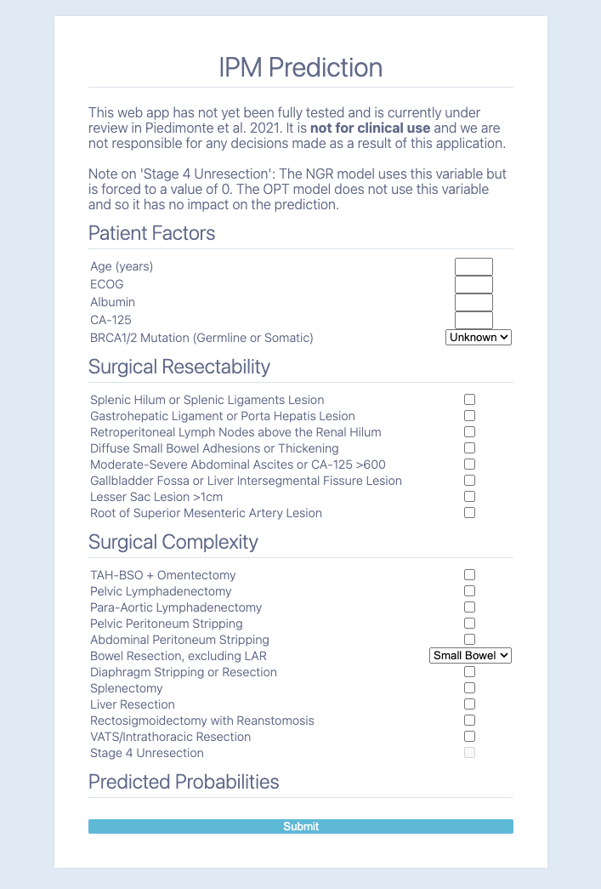

# IPM ML App
## About

A web-app built using flask following factory guidelines for Piedimonte et al. 2021. The app is served using gunicorn with nginx acting as a reverse proxy and is containerized using docker-compose. 

The core of the app are two objective scoring models built to predict the probability of optimal (OPT; `opt.py`) and no growth residual (NGR; `ngr.py`) cytoreduction. Variables, or input metadata, in the prediction scripts have been renamed such that they are python compatible variables (eg. no spaces, separated by variables) and are identical to the variable names in `forms.py`. 

These two files, along with `jmp_score.py` (obtained by being a licensed JMP 15.2+) need to be placed inside the `flask/project/` folder for the app to work correctly.

The site can be accessed outside of KidNet and can be visited at either https://ipm-ml.ccm.sickkids.ca or https://ipm.ccm.sickkids.ca.

